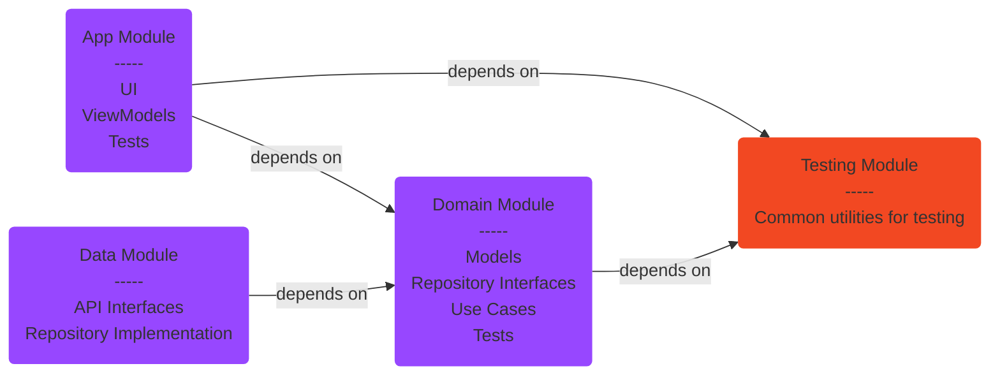
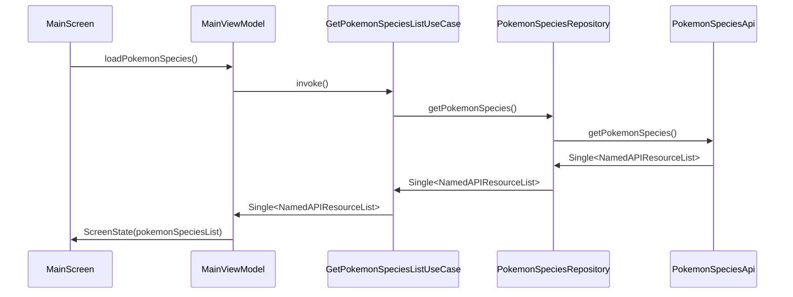

# Solution Brief

The app integrates the Model-View-ViewModel (MVVM) design pattern with Clean Architecture and it's split into the following modules: App, Domain, Data and Testing.

### Dependency graph

**PokéVolve** uses Hilt for dependency injection and Jetpack Compose for the UI.
For testing, the app uses Mockito to mock objects.

### Sequence diagram for loading the list of Pokémon species:

### Application demo
https://github.com/dragosraducanu/pokevolve/assets/3254786/a13e3478-3803-4da1-b9c4-d09996e6d34d

### Other activities that would be needed for a production app, in no particular order (and are not part of this assignment):
- [ ] different build types and product flavors
- [ ] different app environments
- [ ] additional logging for errors, handled exceptions etc. (currently only HttpLoggingInterceptor is being used)
- [ ] crash reporting (Firebase Crashlytics or similar)
- [ ] smoother screen transitions
- [ ] network caching
- [ ] advanced error handling
- [ ] offline support
- [ ] CI/CD pipelines
